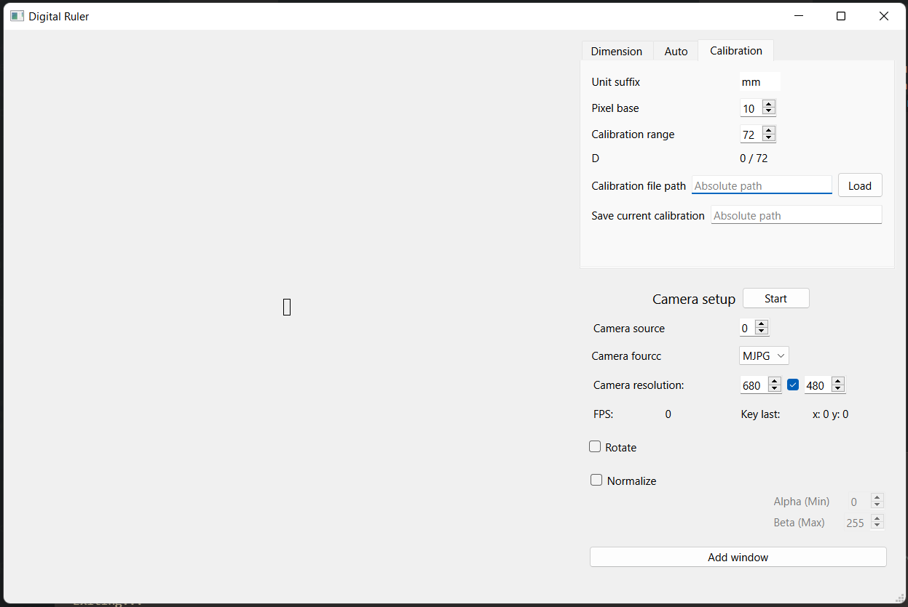
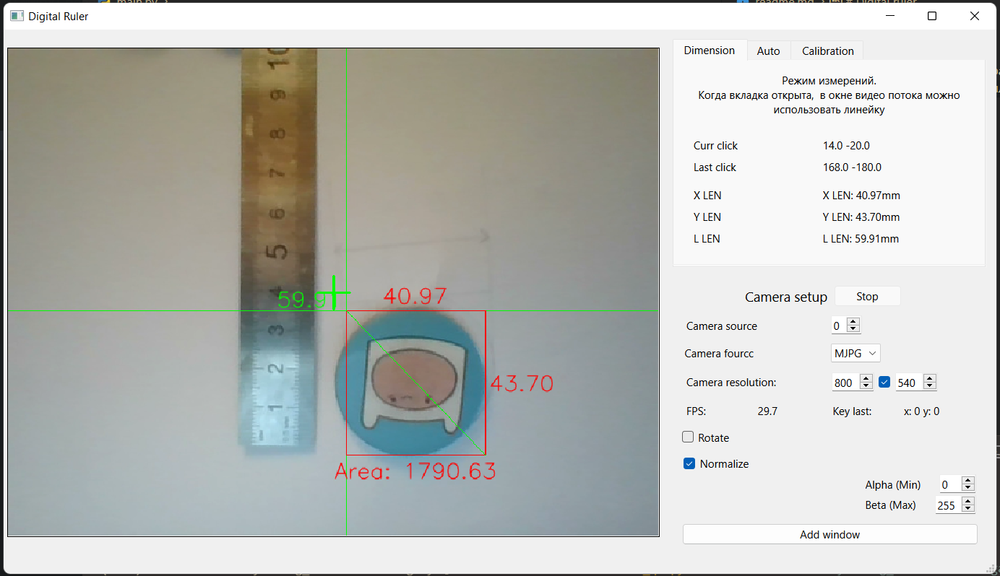
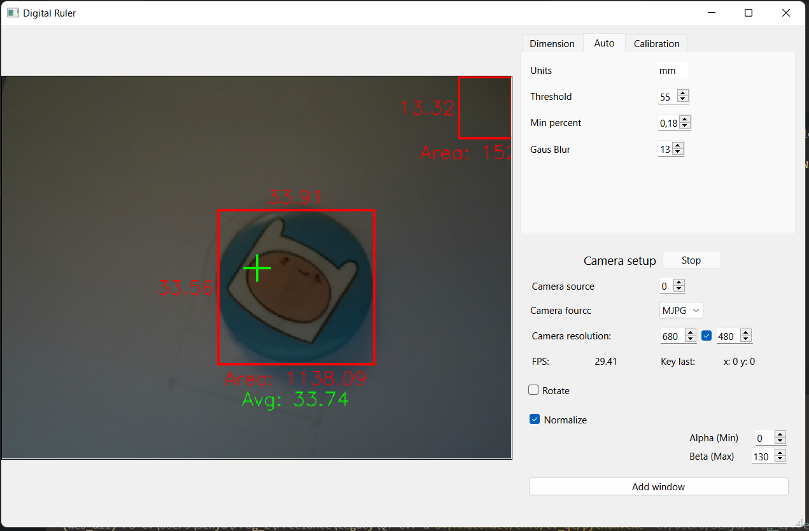

# Digital ruler

Приложение - цифровая линейка, интересный заказ с фриланса  
Позволяет измерить масштаб кадра, зафиксировать его в калибровочном файле, и основываясь на калиброке измерять длинну ширину и площадь объектов

## Демонстрация работы

Режим калибровки
  

Режим измерений

Распознование встроенными методами CV, ценой точности позволяет измерять без предварительной калибровки

## Дополнительные функции

* Создание, сохранение, подключение калибровочных файлов
* Изменение разрешения камеры, с сохранением пропорций и без  
* Поворот камеры на 180 градусов
* Открытие новых окон с видео потоком
* Нормализация изображения (повышение уменьшение контраста)
* Настройка предобработки и порогов распознования моделей CV
